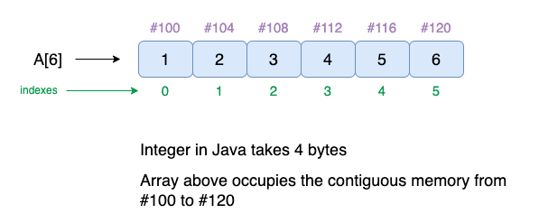

# Array
>[!TIP]
>An array is `a linear data structure that collects elements of the same data type and stores them in contiguous and adjacent memory locations.` Arrays work on an index system starting from 0 to (n-1), where n is the size of the array. It is an array, but there is a reason that arrays came into the picture.. masiv i objectai tipw khit kaden masiv i spiskaai a da c++ i koleksiyai varieblxoai da JS lyuboi tipa xranit kada mewava chi string chi number xamaw da 1 masiv []


~~Array's typeof is a `Object`~~


:basecamp: :basecamp: :basecamp: :basecamp: :basecamp: 


>[!NOTE]
>`Masiv chi qabul mekna?`
-Answear: `Masiv element qabul mekna` `xar yak elemnt index dora`


``` js
let arr = [1 , 2 , 3 , 4 , 5]
arr[3]=false  //this kind we can change array's elemnt
console.log(arr)
```


~~right now we should talk about Array's methods~~

#### JavaScript Array length
>[!TIP]
>The array `length` property in JavaScript is used to set or return the number of elements in an array. 
``` js
function array() {
    let colors = ["green", "blue", "red",
        "yellow", "black", "white"];
 
    console.log(colors.length);
}
array();//Output:6 it will only check length
``` 


#### JavaScript Array toString() Method
>[!TIP]
>The JavaScript Array `toString()` Method returns the string representation of the array elements
`arr.toString()`
``` diff
-Parameters: This method does not accept any parameter!!!
```

* The method returns the string representation of the array elements. 
* If the array is empty, then it returns an empty string.
* The original array is not changed by this method

``` js
// JavaScript to illustrate toString() method
function func() {
	// Original array
	let arr = ["Geeks", "for", "Geeks"];

	// Creating a string
	let str = arr.toString();
	console.log(str);
}
func();//Output:Geeks,for,Geeks
```

#### JavaScript Array join() Method
>[!TIP]
>The JavaScript Array `join()` Method is used to join the elements of an array into a string. The elements of the string will be separated by a specified separator and its default value is a comma`(,)`.
`array.join(separator);`
``` diff
-Parameters:This method accepts a single parameter as mentioned above and described below:
```
* separator: It is Optional i.e, it can be either used as a parameter or not. Its default value is a comma(, ).
  
``` js
function func() {
	let a = [1, 2, 3, 4, 5, 6];
	console.log(a.join('|'));
}
func();//Output:1|2|3|4|5|6
```
``` js
let a = [1, 2, 3, 4, 5, 6];
console.log(a.join(''));//Output:123456
```
 
<!-- #### JavaScript delete Operator
>[!TIP]
>The `delete` operator in JavaScript removes a property from an ~~object~~. It can `delete` both own properties and inherited properties. Using `delete` on an array item leaves a hole.

#### Syntax
``` js
delete object
// or
delete object.property
// or
delete object['property']
```
``` diff
+Parameter: It does not take any parameters.
```
>Return type: This operator returns true if it removes a property. While deleting an object property that doesn’t exist will return a true but it will not affect the object. However, while trying to delete a variable or a function will return a false. -->


#### JavaScript Array concat() Method
>[!TIP]
>The JavaScript Array `concat()` Method is used `to merge two or more arrays together`. This method does not alter the original arrays passed as arguments but instead, `returns a new Array`.

``` diff
-Parameters: The parameters of this method are the arrays or the values that need to be added to the given array. The number of arguments to this method depends upon the number of arrays or values to be merged.
```


``` js
// JavaScript code for concat() method
function func() {
	let alpha = ["a", "b", "c"];
	console.log(alpha.concat(1, [2, 3]));
}
func(); //Output:[ 'a', 'b', 'c', 1, 2, 3 ]
```


``` js
// JavaScript code for concat() method
function func() {
	let num1 = [[23]];
	let num2 = [89, [67]];
	console.log(num1.concat(num2));
}
func();//Output:[ [ 23 ], 89, [ 67 ] ]
```


#### what can do push in js array?
>[!TIP]
>The `push()` method of Array instances `adds the specified elements to the end of an array` and returns the new length of the array. `krch ai okhir dob mekna masivi asosira aliw mekna`
 

``` diff
-Syntax:
```
``` js
push()
push(element1)
push(element1, element2)
push(element1, element2, /* …, */ elementN)
```


* Example
``` js
const sports = ["soccer", "baseball"];
const total = sports.push("football", "swimming");
console.log(sports); // ['soccer', 'baseball', 'football', 'swimming']
console.log(total); // 4
```


#### what can do pop in js array
>[!TIP]
> The `pop()` method of `Array` instances removes the last element from an array and returns that element. This method changes the length of the array.`krch ai oxir ud mekna masivi asosira aliw mekna`
``` diff
-Syntax
```
``` js
pop()//parametrs none
```

``` js
const myFish = ["angel", "clown", "mandarin", "sturgeon"];

const popped = myFish.pop();

console.log(myFish); // ['angel', 'clown', 'mandarin' ]

console.log(popped); // 'sturgeon'
```

#### what can do unshift  in js array

>[!TIP]
> The `unshift()` method of Array instances `adds the specified elements to the beginning of an array and returns the new length of the array.` `i masivi asosira aliw mekna ai aval dob mekna` 


``` js
const array1 = [1, 2, 3];

console.log(array1.unshift(4, 5));
// Expected output: 5

console.log(array1);
// Expected output: Array [4, 5, 1, 2, 3]
```


#### what can do shift  in js array
>[!TIP]
> The `shift()` method of Array instances `removes the first element from an array and returns that removed element`. This method changes the length of the array. 

``` diff
-Syntax
```
 
``` js
shift()
```

``` js
const array1 = [1, 2, 3];

const firstElement = array1.shift();

console.log(array1);
// Expected output: Array [2, 3]

console.log(firstElement);
// Expected output: 1
```


#### what can do indexOf() in js array
>[!TIP]
> The `indexOf()` method of Array instances `returns the first index at which a given element can be found in the array`, or `-1 if it is not present.`krch aga nayoft -1 niwon meta

``` js
const beasts = ['ant', 'bison', 'camel', 'duck', 'bison'];

console.log(beasts.indexOf('bison'));
// Expected output: 1

// Start from index 2
console.log(beasts.indexOf('bison', 2));
// Expected output: 4

console.log(beasts.indexOf('giraffe'));
// Expected output: -1

``` 


#### what can do includes() in js array
>[!TIP]
>The `includes()` method of Array instances determines whether an array ~~includes~~ a certain value among its entries, returning `true` or `false` as appropriate. 

``` js
const array1 = [1, 2, 3];

console.log(array1.includes(2));
// Expected output: true

const pets = ['cat', 'dog', 'bat'];

console.log(pets.includes('cat'));
// Expected output: true

console.log(pets.includes('at'));
// Expected output: false
```


#### what can do slice() in js array
>[!TIP]
> The `slice()` method of Array instances returns a shallow copy of a `portion` of an array `into a new array` object selected from `start` to `end` `(end not included)` where start and end represent the index of items in that array. `The original array will not be modified.`


``` diff
-Syntax
```
``` js
slice()
slice(start)
slice(start, end)
```

``` js
const animals = ['ant', 'bison', 'camel', 'duck', 'elephant'];

console.log(animals.slice(2));
// Expected output: Array ["camel", "duck", "elephant"]

console.log(animals.slice(2, 4));
// Expected output: Array ["camel", "duck"]

console.log(animals.slice(1, 5));
// Expected output: Array ["bison", "camel", "duck", "elephant"]

console.log(animals.slice(-2));
// Expected output: Array ["duck", "elephant"]

console.log(animals.slice(2, -1));
// Expected output: Array ["camel", "duck"]

console.log(animals.slice());
// Expected output: Array ["ant", "bison", "camel", "duck", "elephant"]
```


#### what can do splice() in js array
>[!TIP]
>The `splice()` method of Array instances `changes` the contents of an array `by removing or replacing` existing elements and/or adding new elements in place. 

``` diff
-Syntax
```
``` js
splice(start)
splice(start, deleteCount)
splice(start, deleteCount, item1)
splice(start, deleteCount, item1, item2)
splice(start, deleteCount, item1, item2, /* …, */ itemN)  
```

``` js
const myFish = ["angel", "clown", "drum", "mandarin", "sturgeon"];
const removed = myFish.splice(3, 1);

// myFish is ["angel", "clown", "drum", "sturgeon"]
// removed is ["mandarin"]
```

``` js
const months = ['Jan', 'March', 'April', 'June'];
months.splice(1, 0, 'Feb');
// Inserts at index 1
console.log(months);
// Expected output: Array ["Jan", "Feb", "March", "April", "June"]

months.splice(4, 1, 'May');
// Replaces 1 element at index 4
console.log(months);
// Expected output: Array ["Jan", "Feb", "March", "April", "May"]

```
#### what can do reverse in js array
>[!TIP]
>The `reverse()` method of Array instances `reverses` an array in place and returns the reference to the same array, the first array element now becoming the last, and the last array element becoming the first. In other words, elements order in the array will be turned towards the direction opposite to that previously stated.

```diff
-Syntax
```
``` js
reverse()
```


``` js
const array1 = ['one', 'two', 'three'];
console.log('array1:', array1);
// Expected output: "array1:" Array ["one", "two", "three"]

const reversed = array1.reverse();
console.log('reversed:', reversed);
// Expected output: "reversed:" Array ["three", "two", "one"]

// Careful: reverse is destructive -- it changes the original array.
console.log('array1:', array1);
// Expected output: "array1:" Array ["three", "two", "one"]
```

#### what can do toReversed in js array
>[!TIP]
>The `toReversed()` method of TypedArray instances is the copying counterpart of the `reverse()` method. `It returns a new typed array with the elements in reversed order`. This method has the same algorithm as Array.prototype.toReversed().

``` diff
-Syntax
```

``` js
toReversed()
```
``` js
const uint8 = new Uint8Array([1, 2, 3]);
const reversedUint8 = uint8.toReversed();
console.log(reversedUint8); // Uint8Array [3, 2, 1]
console.log(uint8); // Uint8Array [1, 2, 3]

```
#### What is a callback? 
In simple terms: a callback is a function that must be executed after another function has completed execution (hence the name: callback).
#### agar da yagon metod argumentsh bo funksiya biya callback megan
_________________________________
#### what does map mean in array js
>[!TIP]
> The `map()` method of Array instances `creates a new array` populated with the results of calling a provided function on every element in the calling array. `3 callback qabul mekna: 1 parametr qabul mekna xamu callback map ragi siklai return dora (map a returnw masivi navay masivi ki ba usloviyai ma aliw widai neki length.a liw namekna)`


``` js
const array1 = [1, 4, 9, 16];

// Pass a function to map
const map1 = array1.map((x) => x * 2);

console.log(map1);
// Expected output: Array [2, 8, 18, 32]

```
_______________________________________
#### what does filter mean in array js
>[!TIP]
>The `filter()` method of Array instances creates a shallow copy of a portion of a given array, filtered down to just the elements from the given array that pass the test implemented by the provided function. `i rangi xamu map masivi nav sozdat mekna return dora neki map lengtha aliw kada nametona i metona i metona ba usloviyai mo musorora da musorka partoya iram 3 parametr megira 1 callback`


``` js
const words = ['spray', 'elite', 'exuberant', 'destruction', 'present'];

const result = words.filter((word) => word.length > 6);

console.log(result);
// Expected output: Array ["exuberant", "destruction", "present"]
```
_____________________________________________
#### what does foreach mean in array js
>[!TIP]
>The `forEach()` method of Array instances executes a provided function once for each array element.` i rangi (for)-ai rangi xamu da drunw return kada namewava copy i xami for`

``` js
 ratings = [5, 4, 5];
let sum = 0;

const sumFunction = async (a, b) => a + b;

ratings.forEach(async (rating) => {
  sum = await sumFunction(sum, rating);
});

console.log(sum);
// Naively expected output: 14
// Actual output: 0

```
___________________________________________
#### what does find mean in array js
>[!TIP]
> The `find()` method of Array instances `returns the first element in the provided array` that satisfies the provided testing function. If no values satisfy the testing function, undefined is returned. `i rangi filter nestai i ba xamu usloviya yoft 1 tai avalwa mebrora tamom 3 callback dora` 


* If you need the index of the found element in the array, use `findIndex()`.
* If you need to find the index of a value, use `indexOf()`. (It's similar to `findIndex()`, but checks each element for equality with the value instead of using a testing function.)
* If you need to find if a value exists in an array, use `includes()`. Again, it checks each element for equality with the value instead of using a testing function.
* If you need to find if any element satisfies the provided testing function, use `some()`.
* If you need to find all elements that satisfy the provided testing function, use `filter()`.


``` js
const array1 = [5, 12, 8, 130, 44];

const found = array1.find((element) => element > 10);

console.log(found);
// Expected output: 12
```
__________________________________________
#### what does sort mean in array js
>[!TIP]
>The `sort()` method of Array instances sorts the elements of an array in place and returns the reference to the same array, now sorted. The default sort order is ascending, built upon converting the elements into strings, then comparing their sequences of UTF-16 code units values.`i masivi asosira aliw mekna. Sort 2 parametr megira 1 callback dora`

``` diff
-Parameters
```


- A function that determines the order of the elements. The function is called with the following arguments:

- a

- The first element for comparison. Will never be undefined.
- b

- The second element for comparison. Will never be undefined.

- It should return a number where:

- A negative value indicates that a should come before b.
- A positive value indicates that a should come after b.
- Zero or NaN indicates that a and b are considered equal.

- To memorize this, remember that (a, b) => a - b sorts numbers in ascending order.

- If omitted, the array elements are converted to strings, then sorted according to each character's Unicode code point value.


``` js
function compareNumbers(a, b) {
  return a - b;
}
```

``` js
const stringArray = ["Blue", "Humpback", "Beluga"];
const numberArray = [40, 1, 5, 200];
const numericStringArray = ["80", "9", "700"];
const mixedNumericArray = ["80", "9", "700", 40, 1, 5, 200];

function compareNumbers(a, b) {
  return a - b;
}

stringArray.join(); // 'Blue,Humpback,Beluga'
stringArray.sort(); // ['Beluga', 'Blue', 'Humpback']

numberArray.join(); // '40,1,5,200'
numberArray.sort(); // [1, 200, 40, 5]
numberArray.sort(compareNumbers); // [1, 5, 40, 200]

numericStringArray.join(); // '80,9,700'
numericStringArray.sort(); // ['700', '80', '9']
numericStringArray.sort(compareNumbers); // ['9', '80', '700']

mixedNumericArray.join(); // '80,9,700,40,1,5,200'
mixedNumericArray.sort(); // [1, 200, 40, 5, '700', '80', '9']
mixedNumericArray.sort(compareNumbers); // [1, 5, '9', 40, '80', 200, '700']

```
_________________________________________________
#### what does toSorted mean in array js
>[!TIP]
>The `toSorted()` method of Array instances is the copying version of the sort() method. It returns a new array with the elements sorted in ascending order. `iram rangi Sort() ai a,b dora da parametrw neki masivi asosira aliw namekna`

``` diff
-Syntax
```
``` js
toSorted()
toSorted(compareFn)
```

``` js
const months = ["Mar", "Jan", "Feb", "Dec"];
const sortedMonths = months.toSorted();
console.log(sortedMonths); // ['Dec', 'Feb', 'Jan', 'Mar']
console.log(months); // ['Mar', 'Jan', 'Feb', 'Dec']

const values = [1, 10, 21, 2];
const sortedValues = values.toSorted((a, b) => a - b);
console.log(sortedValues); // [1, 2, 10, 21]
console.log(values); // [1, 10, 21, 2]
```
:beginner: :basecamp: :basecamp: :basecamp: :basecamp: :basecamp: :basecamp:


~~-~~~~-~~~~-~~~~-~~~~-~~~~-~~~~-~~~~-~~~~~~-~~~~-~~~~~~-~~~~-~~~~-~~~~-~~~~-~~~~-~~~~-~~~~~~-~~~~-~~
#### what can do reduce in js?
>[!TIP]
>The array `reduce` in JavaScript is a predefined method used to reduce an array to a single value by passing a `callback` function on each element of the array. It accepts a function executed on all the items of the specified array in the left-to-right sequence. The returned single value is stored in the accumulator.
`i 1 callback dora 4 vallue accumulyator ~nachalni sostoyani agar nachalni sostoyani natem aftomaticheski ai avali array megira bad el,index,array (accumulyator nachalni sostoyani megira)`
>bo ya chii diga reduce chi vozvrowat mekna reduce acc vozvrowat mekna
>acc chiay (acc - element)


``` js
const data = [[1, 2, 3], [4, 5, 6], [7, 8, 9]];

const flat = data.reduce((total, amount) => {
  return total.concat(amount);
}, []);

flat // [ 1, 2, 3, 4, 5, 6, 7, 8, 9 ]
```


#### what does mean destructuring in js
>[!TIP]
>JavaScript Object Destructuring is the syntax for extracting values from an object property and assigning them to a variable. The destructuring is also possible for JavaScript Arrays. By default, the object key name becomes the variable that holds the respective value.`По умолчанию имя ключа объекта становится переменной, содержащей соответствующее значение.`
`yakchand elementi masiva izvlekat mekni da 1 varieble `


``` js
let a, b, rest;
[a, b] = [10, 20];

console.log(a);
// Expected output: 10

console.log(b);
// Expected output: 20

[a, b, ...rest] = [10, 20, 30, 40, 50];

console.log(rest);
// Expected output: Array [30, 40, 50]

```

``` diff
-Syntax
```


``` js
const [a, b] = array;
const [a, , b] = array;
const [a = aDefault, b] = array;
const [a, b, ...rest] = array;
const [a, , b, ...rest] = array;
const [a, b, ...{ pop, push }] = array;
const [a, b, ...[c, d]] = array;

const { a, b } = obj;
const { a: a1, b: b1 } = obj;
const { a: a1 = aDefault, b = bDefault } = obj;
const { a, b, ...rest } = obj;
const { a: a1, b: b1, ...rest } = obj;
const { [key]: a } = obj;

let a, b, a1, b1, c, d, rest, pop, push;
[a, b] = array;
[a, , b] = array;
[a = aDefault, b] = array;
[a, b, ...rest] = array;
[a, , b, ...rest] = array;
[a, b, ...{ pop, push }] = array;
[a, b, ...[c, d]] = array;

({ a, b } = obj); // parentheses are required
({ a: a1, b: b1 } = obj);
({ a: a1 = aDefault, b = bDefault } = obj);
({ a, b, ...rest } = obj);
({ a: a1, b: b1, ...rest } = obj);

```


#### js spread array
>[!TIP]
>`...spread` You can use it to merge or clone an array. Or use it to convert iterables to an array.

``` js
// Merge Array
[...array1, ...array2]

// Clone Array
[...array]

// String → Array
[...'string']

// Set  → Array
[...new Set([1,2,3])]

// Node List → Array
[...nodeList]

// Arguments → Array
[...arguments]
```

#### ...Spread is like Russian Dolls

>The spread syntax takes your array and expands it into elements. Imagine your array is like those Russian Dolls. When you call the spread syntax on it, it will take the nested individual doll out and lay it out in its own individual pieces.`spread xijvaqt silkoora uniq namekna u faqat rangi xami surat elementoi masiva kopi mekna drunwona judo mekna`


#### rest... 
>[!TIP]
>`vaqte da function chan parametr biya mo resta istifoda mebarem rest beskonechno qabul mekna`


``` js
function sum(...theArgs) {
  let total = 0;
  for (const arg of theArgs) {
    total += arg;
  }
  return total;
}

console.log(sum(1, 2, 3));
// Expected output: 6

console.log(sum(1, 2, 3, 4));
// Expected output: 10
```

``` js
function get(...arrgument){
	return [...arrgument]
}
console.log(get([1,2,3,4],[1,2,3,4]))//[ [ 1, 2, 3, 4 ], [ 1, 2, 3, 4 ] ]

```

``` js
function get(...a) {
    let a1 =[...a]
   return a1
}
console.log(get(1,2,3)); //[ 1, 2, 3 ]
```
^|^ 
in the top you can see that if we dont know how much arguments will user enter we use `...rest`